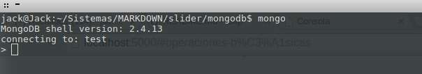
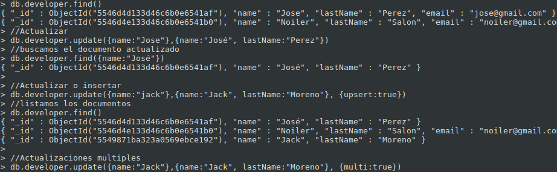
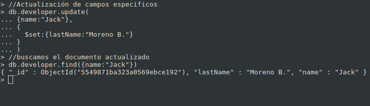
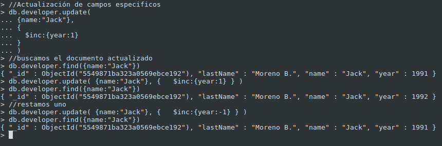
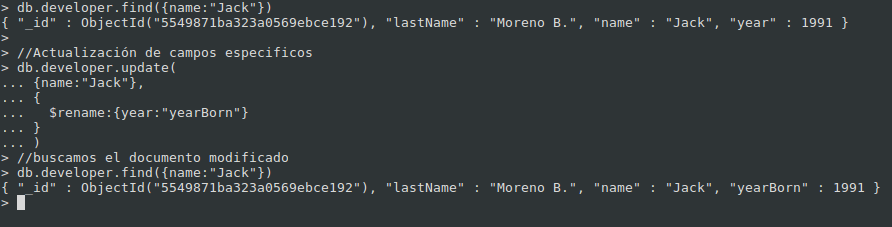

#MongoDB

---
#Agenda

 * MongoDB
 * Desarrollo
    * Operaciones Básicas
    * Modelado de Datos
    * Índices
    * Busquedas Avanzadas
 * Producción
    * Seguridad
    * Respaldo y restauración
    * Replicación

---
#NoSQl

* Difieren del modelo relacional del Sistema de Gestion de  base de datos clasico.
* No usan SQL como principal lenguaje de consulta.
* Escalabilidad Horizontal.

---
#MongoDB

* Sistema de base de datos NoSQL orientado a documentos.
* Guarda estructuras de datos en documentos tipo JSON con un esquema dinámico (BSON).
* Desarrollado en el 2007 por la empresa 10gen.
* En el 2011 se garantiza su uso en producción.

---
#Caracteristicas

* Almacenamiento orientado a documentos (document-oriented en inglés).
* Replicación y Alta Disponibilidad.
* Soporte de índices.
* Consultas, también basadas en documentos.
* Auto-Sharding, permitiendo escalar horizontalmente.
* GridFS, que permite almacenar ficheros de cualquier tamaño sin necesidad de complicar el entorno.

---
#Tipos de datos que soporta

* Number
* String
* Boolean (true o false)
* Array
* Object
* null

---
#Se aplica en:

* Para  almacenar grandes cantidades de datos.
* Aplicalicaciones con estructura compleja:

    - Blog
    - Comentarios
    - Logs
    - Otros

---
#Instalación

---
# Sistemas basados en Debian

Inportamos las llaves

* sudo apt-key adv --keyserver keyserver.ubuntu.com --recv 7F0CEB10

Creamos el archivo fuente

* echo ‘deb http://downloads-distro.mongodb.org/repo/debian-sysvinit dist 10gen’ | sudo tee /etc/apt/sources.list.d/mongodb.list

Actualizamos

* sudo apt-get update

Instalación:
* Plataforma de 32bits

    * sudo apt-get install mongodb-10gen

* Plataforma de 64bits

    * sudo apt-get install -o apt::architecture=amd64 mongodb-10gen

---
# Sistemas basados en Windows

* Recomendaciones:
    * A partir de la versión 2.2, MongoDB deja de ser  compatible con Windows XP.
    Para window server 2008 y w7 se debe de instalar una actualización.
* Instalación:
    * Descargar la versión adecuada para nuestra S.O.
    * Crear una carpeta llamada *mongodb* en *C:* y colocamos el contenido de lo descargado.
    * Crear una carpeta llamada *data* en *C:*.
    * Crear una carpeta llamada *log* en *C:/mongodb*.
    * Para que funcione como servicio tenemos que ejecutar:
        * echo logpath=C:\mongodb\log\mongo.log > C:\mongodb\mongod.cfg
    * Instalar el servicio
        * C:\mongodb\bin\mongod.exe --config C:\mongodb\mongod.cfg --install
    * Gestionar el servicio MongoDB
        *  net [ start | stop ] MongoDB

---
# Configuración

* Sistemas Linux
    * /etc/mongodb.conf

* Sistemas Windows
    * C:\mongodb\mongod.cfg

---
#Consola

* Sistemas Linux
    * Escribir en la consola *mongo*

* Sistemas Windows
    * ejecutar  C:\mongodb\bin\mongo.exe

---
#Iniciando Mongo

---
#Operaciones Básicas

---

---
###Operaciones Básicas

---
###Operaciones Básicas

---
###Operaciones Básicas

---
#Operadores de MOdificación

---
###Operadores de Modificación

$set : permite especificar los campos en el documento.

$inc: permite adicionar sobre el campo del tipo entero en un campo.

$rename : permite reescribir el campo.

$unset : permite eliminar un campo.

---
## Operador de Modificación: $set

---
## Operador de Modificación: $inc

---
## Operador de Modificación: $rename

---
## Operador de Modificación: $unset

---
#Operadores de Modificación

##Operadores referentes a arreglos

$pop - elimina el primer o último valor de un arreglo.

$pull - elimina los valores de un arreglo que cumplan con el filtro indicado.

$pullAll - elimina los valores especificados de un arreglo.

$push - agrega un elemento a un arreglo.

$addToSet - agrega elementos a un arreglo solo sí estos no existen ya.

$each 

---
#Modelado de Base de Datos

##Patrones de Modelado
####    Principalmente dos patrones:

    * *Embeber:* Incrustar un documento dentro de otro

    * *Referenciar:* replicar las funciones de las llaves foraneas

---
###Relaciones:
####1 - 1 (base de datos relacional)

---
###Relaciones:
####1 - 1 (Mongodb: Embeber)

---
###Relaciones:
####1 - * (base de datos relacional)

---
###Relaciones:
####1 - * (MongoDB -  Embeber)

---
###Relaciones:
####1 - * (MongoDB -  Referenciar)

---
###Relaciones:
####1 - * (base de datos relacional)

---
#Indexación

Es una estructura de datos que toma los valores de campos particulares 
se almacena en un espacio de rápido acceso

####Tipos de índice

* Índice_id - el identificador principal de un registro es el índice por defecto, si no especificas uno al crear un documento el proceso de mongod le asignará uno automaticamente de tipo ObjectID.
* Índice sencillo - definidos sobre un único campo de un documento.
* Índice compuesto - definidos sobre varios campos de un documento, será tomado como un índice único por parte de MongoDB.
* Índice mutillave - utilizado en casos de que el campo a indexar pertenezca a subdocumentos dentro de un arreglo del documento padre.
* Índice geoespacial - utilizado para indexar campos que sean coordenadas de tipo GeoJSON.
* Índice texto - al momento de escritura se encuentra fase beta y se utiliza para buscar contenidos de cadenas de caracteres en los documentos.
* Índice tipo hash - utilizado en la estrategia de llaves de fragmento hasheadas que se lleva a cabo en los procesos de fragmentación de datos.

---
####Index Simple

---
####Index Simple

---
###Index Compuesto

---

Indices Multillave
simple
> db.puntuaciones.ensureIndex({ campoArray: 1 });
arreglo
> db.puntuaciones.ensureIndex({ campoArray.sub_campo: 1 });
Propiedades
unicidad : db.puntuaciones.ensureIndex({ campo : 1 }, { unique : true })
dispersión : > db.puntuaciones.ensureIndex({ ganadas : 1 }, { sparse : true })
eliminar indices 
db.puntuaciones.dropIndex({ campo_que_deseo_eliminar_el_indice : 1 })
db.puntuaciones.dropIndexes()

####Propiedades:

* Unicidad

* Disperción

---
#Auto-Incrementación

---
#Búsquedas Avanzadas

---
#Seguridad

---
#Respaldo y Restauración

---
#Replicación

---
#Fragmentación

---
#Agregación

---
#Producción
