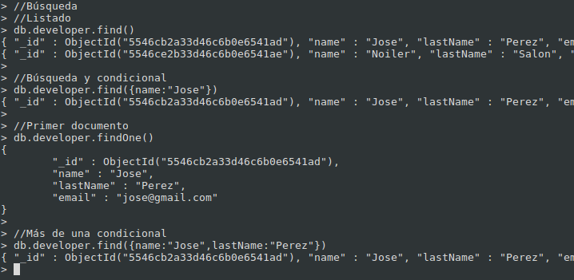

#MongoDB

---
#Agenda

 * MongoDB
 * Desarrollo
    * Operaciones Básicas
    * Modelado de Datos
    * Índices
    * Busquedas Avanzadas
 * Producción
    * Seguridad
    * Respaldo y restauración
    * Replicación

---
#NoSQl

* Difieren del modelo relacional del Sistema de Gestion de  base de datos clasico.
* No usan SQL como principal lenguaje de consulta.
* Escalabilidad Horizontal.

---
#MongoDB

* Sistema de base de datos NoSQL orientado a documentos.
* Guarda estructuras de datos en documentos tipo JSON con un esquema dinámico (BSON).
* Desarrollado en el 2007 por la empresa 10gen.
* En el 2011 se garantiza su uso en producción.

---
#Caracteristicas

* Almacenamiento orientado a documentos (document-oriented en inglés).
* Replicación y Alta Disponibilidad.
* Soporte de índices.
* Consultas, también basadas en documentos.
* Auto-Sharding, permitiendo escalar horizontalmente.
* GridFS, que permite almacenar ficheros de cualquier tamaño sin necesidad de complicar el entorno.

---
#Tipos de datos que soporta

* Number
* String
* Boolean (true o false)
* Array
* Object
* null

---
#Se aplica en:

* Para  almacenar grandes cantidades de datos.
* Aplicalicaciones con estructura compleja:

    - Blog
    - Comentarios
    - Logs
    - Otros

---
#Instalación

---
# Sistemas basados en Debian

Inportamos las llaves

* sudo apt-key adv --keyserver keyserver.ubuntu.com --recv 7F0CEB10

Creamos el archivo fuente

* echo ‘deb http://downloads-distro.mongodb.org/repo/debian-sysvinit dist 10gen’ | sudo tee /etc/apt/sources.list.d/mongodb.list

Actualizamos

* sudo apt-get update

Instalación:
* Plataforma de 32bits

    * sudo apt-get install mongodb-10gen

* Plataforma de 64bits

    * sudo apt-get install -o apt::architecture=amd64 mongodb-10gen

---
# Sistemas basados en Windows

* Recomendaciones:
    * A partir de la versión 2.2, MongoDB deja de ser  compatible con Windows XP.
    Para window server 2008 y w7 se debe de instalar una actualización.
* Instalación:
    * Descargar la versión adecuada para nuestra S.O.
    * Crear una carpeta llamada *mongodb* en *C:* y colocamos el contenido de lo descargado.
    * Crear una carpeta llamada *data* en *C:*.
    * Crear una carpeta llamada *log* en *C:/mongodb*.
    * Para que funcione como servicio tenemos que ejecutar:
        * echo logpath=C:\mongodb\log\mongo.log > C:\mongodb\mongod.cfg
    * Instalar el servicio
        * C:\mongodb\bin\mongod.exe --config C:\mongodb\mongod.cfg --install
    * Gestionar el servicio MongoDB
        *  net [ start | stop ] MongoDB

---
# Configuración

* Sistemas Linux
    * /etc/mongodb.conf

* Sistemas Windows
    * C:\mongodb\mongod.cfg

---
#Consola

* Sistemas Linux
    * Escribir en la consola *mongo*

* Sistemas Windows
    * ejecutar  C:\mongodb\bin\mongo.exe

---
#Iniciando Mongo

---
#Operaciones Básicas

---

---
###Operaciones Básicas

---
###Operaciones Básicas

---

